# CellDynamicST

<!-- badges: start -->
[](https://github.com/GoogleXie/CellDynamicST/actions/workflows/R-CMD-check.yaml)
[](https://www.gnu.org/licenses/gpl-3.0)
<!-- badges: end -->

**CellDynamicST** is an R package for comprehensive spatial transcriptomic analysis of cell dynamics, gene expression networks, and neurotransmitter classification in brain tissue. It implements a reference-based generalized clustering algorithm with Random Forest label propagation, neurotransmitter and glial cell classification via Gaussian Mixture Models, hierarchical cell type annotation, spatial GO enrichment at single-cell resolution, inter-regional weighted gene co-expression network analysis (WGCNA), and hub gene detection. The package accepts any spatial transcriptomic dataset (CosMx, MERFISH, Visium) as a Seurat object and is configured via a single YAML file specifying experimental design, comparisons, and analysis parameters.

---

## Visualization Gallery

CellDynamicST generates publication-quality figures at every stage of the analysis pipeline. Below are representative outputs from the Oprm1 A118G spatial transcriptomics dataset.

### Cell Type Hierarchy (Alluvial / Sankey)

Multi-level alluvial diagram showing how cells flow from broad categories (Neuronal, Glial, Other) through neurotransmitter types to detailed cell type annotations. Band widths are proportional to cell counts.

<p align="center">
  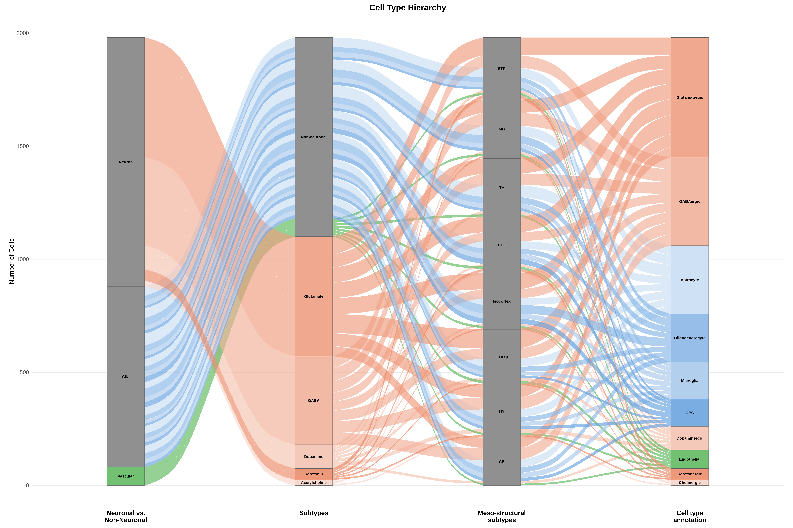
</p>

### Multi-Dimensional Heatmap

Circle heatmap displaying cell type × brain region interactions. Circle size encodes cell count; color encodes percentage change between conditions. Top and right margins show stacked bars for cell type and neurotransmitter distributions.

<p align="center">
  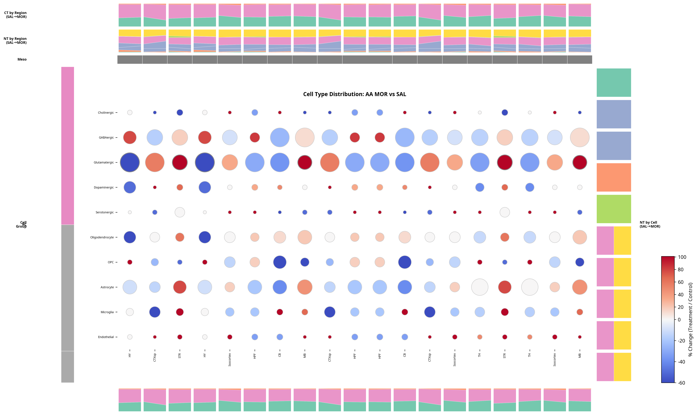
</p>

### Disproportion Analysis on t-SNE

t-SNE embedding colored by disproportion z-scores between two experimental conditions. Blue indicates enrichment in condition A (depletion in B); red indicates enrichment in condition B. Labels at cell type centroids identify the most affected populations.

<p align="center">
  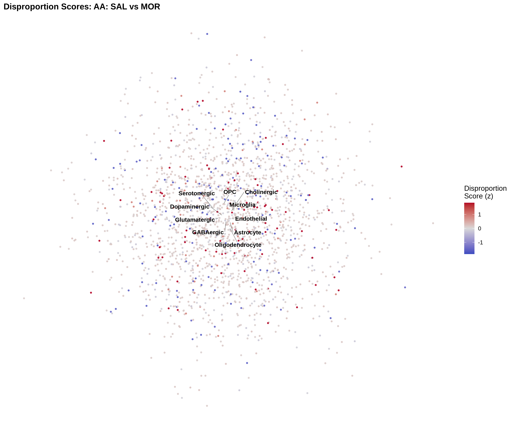
</p>

### Volcano Plot

Differential expression volcano plot with genes colored by significance and direction: blue = significantly downregulated, red = significantly upregulated, grey = not significant. Top genes are labeled by name.

<p align="center">
  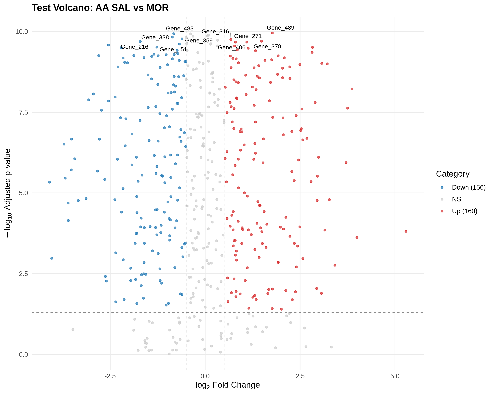
</p>

### GO Enrichment Comparison (2×2 Design)

Bidirectional GO enrichment plot optimized for 2×2 factorial experiments. Central bars show the direction and magnitude of difference between conditions. Left/right dots represent weighted enrichment scores for each condition, with dot size encoding |log2FC| and color encoding statistical significance.

<p align="center">
  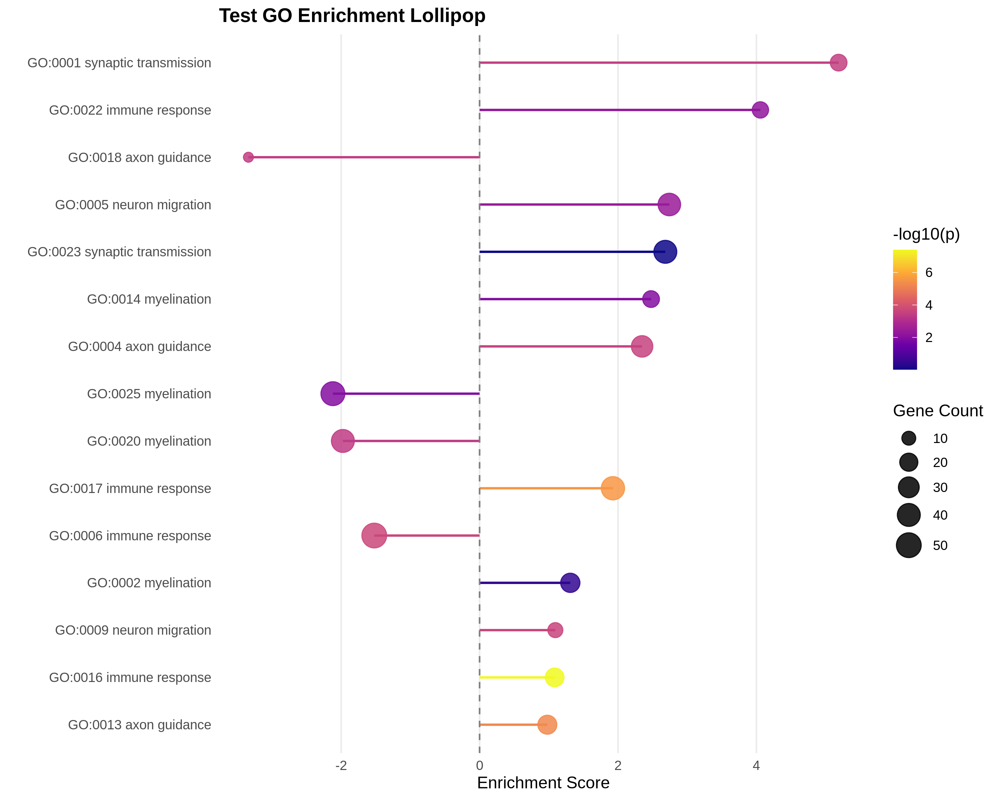
</p>

### WGCNA Module-Trait Heatmap

Pearson correlation between WGCNA module eigengenes and experimental traits. Significance is indicated by stars (* p < 0.05, ** p < 0.01, *** p < 0.001).

<p align="center">
  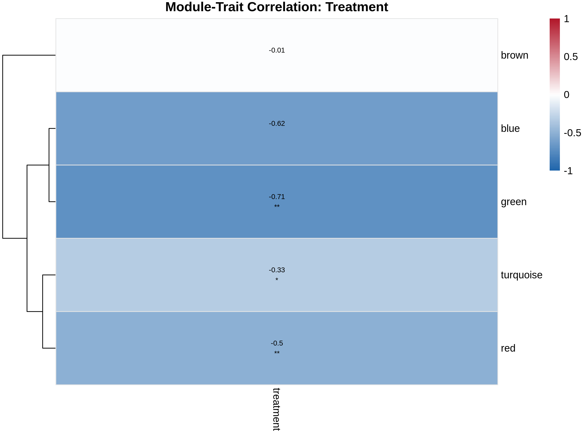
</p>

### WGCNA Circos Plot

Multi-ring circos diagram with WGCNA modules as segments. Concentric rings display different experimental comparisons (OUD enrichment, treatment effects by genotype, genotype effects by treatment).

<p align="center">
  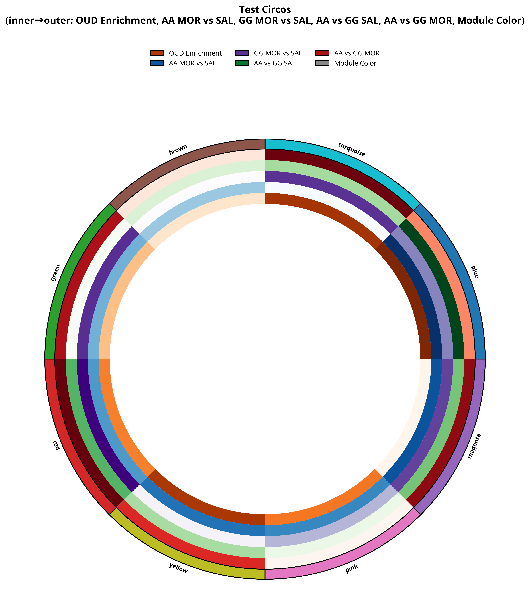
</p>

### Hub Gene Network

Force-directed network of hub genes (gold, larger nodes) and their co-expressed neighbors (light blue). Edge thickness reflects co-expression strength.

<p align="center">
  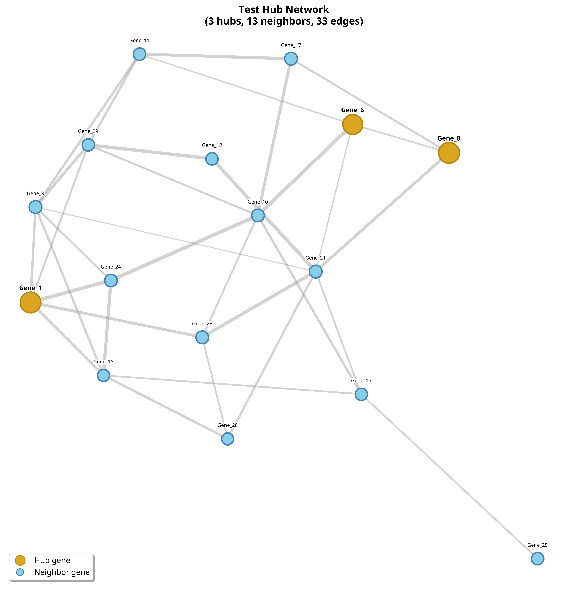
</p>

### Atlas Network (Allen Brain Atlas)

Brain region co-expression network overlaid on Allen Brain Atlas contours. Supports sagittal, coronal, and horizontal slice planes with configurable coordinates.

<p align="center">
  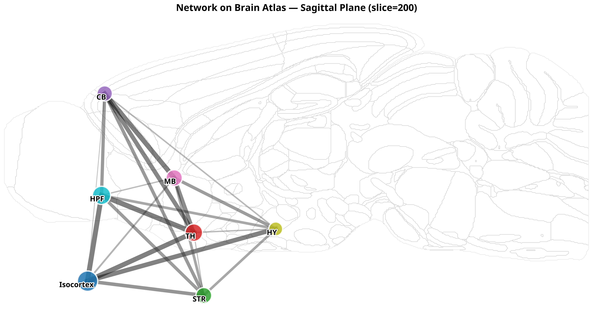
</p>

### Spatial Enrichment

Spatial scatter plot showing GO term enrichment scores mapped onto tissue coordinates. Orange = enriched; purple = depleted.

<p align="center">
  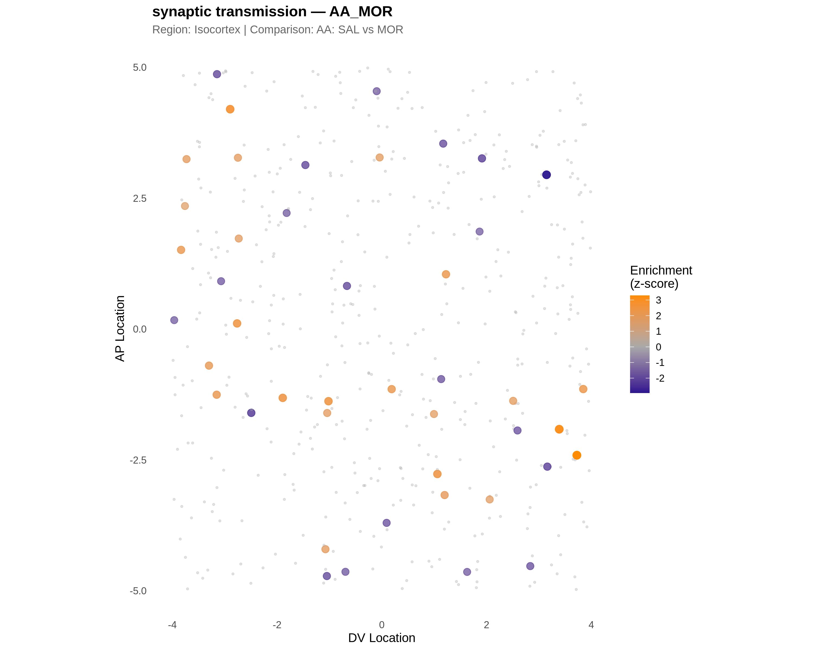
</p>

### QC Summary

Three-panel QC figure: distribution of transcripts per cell, genes per cell, and genes vs. transcripts scatter across experimental groups.

<p align="center">
  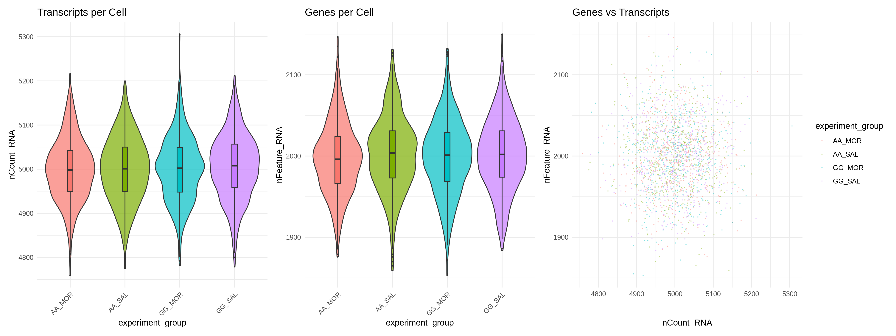
</p>

### Cell Proportions

Stacked bar chart of cell type proportions across experimental groups, revealing genotype- and treatment-dependent shifts in cellular composition.

<p align="center">
  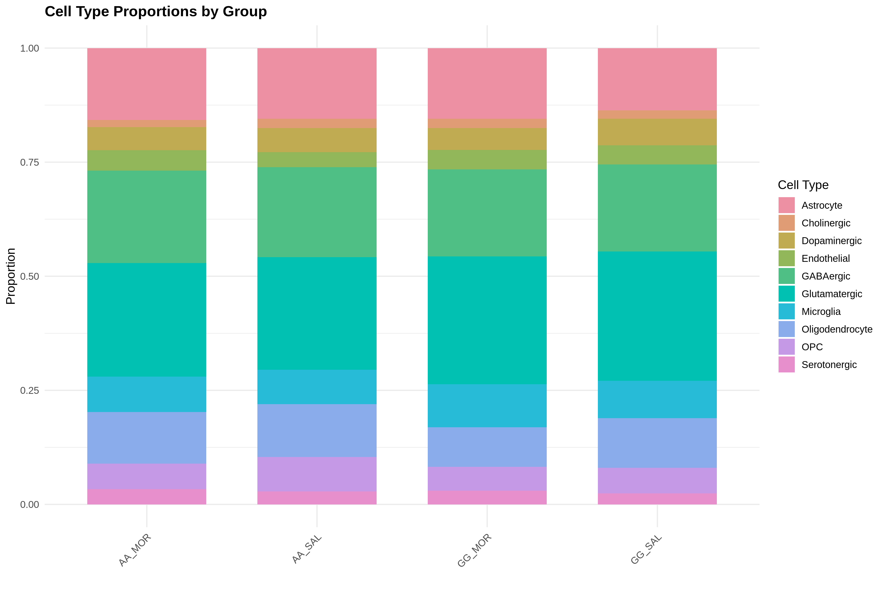
</p>

---

## Table of Contents

1. [Installation](#1-installation)
2. [Prepare Your Data](#2-prepare-your-data)
3. [Create Your Configuration File](#3-create-your-configuration-file)
4. [Step 1 — Load and Register Samples](#4-step-1--load-and-register-samples)
5. [Step 2 — Quality Control and Normalization](#5-step-2--quality-control-and-normalization)
6. [Step 3 — Clustering](#6-step-3--clustering)
7. [Step 4 — Neurotransmitter Classification](#7-step-4--neurotransmitter-classification)
8. [Step 5 — Glial Subtype Classification](#8-step-5--glial-subtype-classification)
9. [Step 6 — Cell Dynamics Analysis](#9-step-6--cell-dynamics-analysis)
10. [Step 7 — Differential Expression](#10-step-7--differential-expression)
11. [Step 8 — WGCNA Network Analysis](#11-step-8--wgcna-network-analysis)
12. [Step 9 — Visualization](#12-step-9--visualization)
13. [One-Command Pipeline](#13-one-command-pipeline)
14. [Output Structure](#14-output-structure)
15. [Function Reference](#15-function-reference)
16. [Docker](#16-docker)
17. [Troubleshooting](#17-troubleshooting)
18. [Citation](#18-citation)

---

## 1. Installation

### From GitHub (recommended)

```r
install.packages("remotes")
remotes::install_github("GoogleXie/CellDynamicST")
```

If you need all optional dependencies (WGCNA, clusterProfiler, igraph for network plots, etc.), install with:

```r
remotes::install_github("GoogleXie/CellDynamicST", dependencies = TRUE)
```

### From a local tarball

```bash
git clone https://github.com/GoogleXie/CellDynamicST.git
R CMD INSTALL CellDynamicST
```

### With Docker (zero configuration)

```bash
git clone https://github.com/GoogleXie/CellDynamicST.git
cd CellDynamicST
docker-compose up
# Open http://localhost:8787 in your browser (RStudio Server)
```

**Typical install time:** 5 to 10 minutes on a standard desktop with broadband internet. The Docker image takes 15 to 20 minutes on first build because it compiles Seurat and WGCNA from source.

### System Requirements

| Requirement | Minimum |
|---|---|
| R | >= 4.1.0 |
| Operating System | Linux, macOS, or Windows |
| RAM (< 100K cells) | 16 GB |
| RAM (100K -- 500K cells) | 32 GB |
| RAM (500K -- 1M cells) | 64 GB |
| RAM (> 1M cells) | 128 GB |

---

## 2. Prepare Your Data

CellDynamicST expects your spatial transcriptomic data as **Seurat objects saved as `.rds` files** — one file per sample. If you are starting from platform-specific outputs (CosMx flat files, MERFISH cell-by-gene matrices, or Visium Space Ranger output), convert them to Seurat objects first using the standard Seurat import functions, then save each sample:

```r
# Example: convert a CosMx flat-file export to a Seurat object
library(Seurat)

obj <- LoadNanostring(data.dir = "path/to/cosmx_output/", fov = "fov")
saveRDS(obj, "data/sample_01.rds")
```

Organize your `.rds` files in a single directory. The file names do not matter — the configuration file maps each file path to a sample ID and experimental group.

```
data/
├── mouse_01_AA_SAL.rds
├── mouse_02_AA_SAL.rds
├── mouse_03_AA_MOR.rds
├── mouse_04_GG_SAL.rds
├── mouse_05_GG_MOR.rds
└── ...
```

### Required metadata

Each Seurat object should contain spatial coordinates in its metadata. CellDynamicST looks for `x_coord` and `y_coord` columns by default, but you can remap any column names during the loading step. If your data comes from CosMx or MERFISH, these coordinates are typically already present as `x_FOV_px`, `y_FOV_px`, or `CenterX_global_px` / `CenterY_global_px`.

Brain region annotations (e.g., `brain_region_L3`, `brain_region_L7`) are used by the DEG and WGCNA modules. If your data does not have region annotations, you can add them manually or use `cdst_register_atlas()` to map spatial coordinates to the Allen Brain Atlas.

---

## 3. Create Your Configuration File

Every CellDynamicST analysis is driven by a **single YAML configuration file**. This file replaces all hardcoded paths, group names, and thresholds that would otherwise be scattered across scripts. Generate a template:

```r
library(CellDynamicST)

cdst_create_config_template("my_experiment.yaml")
```

Open `my_experiment.yaml` in any text editor and fill in the five sections. Here is a complete, annotated example for a 2×2 factorial design (genotype × treatment):

```yaml
# ---- Project metadata ----
project_name: "Oprm1_A118G_Spatial"
species: "mouse"
output_dir: "cdst_output"

# ---- Experimental groups ----
# Define every group. Mark exactly one as is_reference: true.
# The reference group is used as the baseline for clustering.
groups:
  - name: "AA SAL"
    genotype: "AA"
    treatment: "SAL"
    is_reference: true

  - name: "AA MOR"
    genotype: "AA"
    treatment: "MOR"

  - name: "GG SAL"
    genotype: "GG"
    treatment: "SAL"

  - name: "GG MOR"
    genotype: "GG"
    treatment: "MOR"

# ---- Sample paths (optional) ----
# Map each data file to a sample ID and experimental group.
# If omitted, provide a Seurat object directly to cdst_run().
samples:
  - id: "mouse_01"
    path: "data/mouse_01_AA_SAL.rds"
    group: "AA SAL"
  - id: "mouse_02"
    path: "data/mouse_02_AA_MOR.rds"
    group: "AA MOR"
  - id: "mouse_03"
    path: "data/mouse_03_GG_SAL.rds"
    group: "GG SAL"
  - id: "mouse_04"
    path: "data/mouse_04_GG_MOR.rds"
    group: "GG MOR"

# ---- Pairwise comparisons for DEG analysis ----
comparisons:
  - name: "treatment_AA"
    group1: "AA SAL"
    group2: "AA MOR"
  - name: "treatment_GG"
    group1: "GG SAL"
    group2: "GG MOR"
  - name: "genotype_baseline"
    group1: "AA SAL"
    group2: "GG SAL"
  - name: "genotype_treated"
    group1: "AA MOR"
    group2: "GG MOR"

# ---- QC thresholds ----
qc:
  min_count_percentile: 0.05
  min_feature_percentile: 0.05
  min_cells_per_fov: 500
  min_transcripts_per_cell: 100
  max_neg_probe_per_cell: 1.0

# ---- Clustering parameters ----
clustering:
  n_pcs: 100
  bias_threshold: 0.7
  annoy_trees: 100
  k_neighbors: 50
  resolution: 20
  rf_ntree: 200

# ---- WGCNA parameters ----
wgcna:
  soft_power: null          # null = auto-detect
  min_module_size: 20
  deep_split: 3
  merge_cut_height: 0.10
  min_cells_per_region: 100

# ---- Brain atlas ----
atlas:
  name: "Allen_CCFv3"
  plane: "sagittal"         # sagittal, coronal, or horizontal
  slice: null               # null = auto midpoint
  resolution: 10            # 10um or 25um
  region_columns:
    L3: "brain_region_L3"
    L5: "brain_region_L5"
    L7: "brain_region_L7"
```

Load and validate the configuration:

```r
config <- cdst_load_config("my_experiment.yaml")
# If any field is invalid, you will see a clear error message
# describing what to fix.
```

---

## 4. Step 1 — Load and Register Samples

Load each sample as a Seurat object and standardize its metadata columns. The `cdst_load_seurat()` function accepts an `.rds` file path, a CosMx output directory, or a pre-built Seurat object.

```r
library(CellDynamicST)

config <- cdst_load_config("my_experiment.yaml")

# Load a single sample
obj <- cdst_load_seurat("data/mouse_01_AA_SAL.rds", config)
```

If your metadata columns have non-standard names, pass a mapping:

```r
obj <- cdst_load_seurat(
  "data/mouse_01.rds",
  config,
  metadata_mapping = c(
    experiment_group = "condition",
    sample_id        = "mouse_id",
    x_coord          = "CenterX_global_px",
    y_coord          = "CenterY_global_px"
  )
)
```

### Loading multiple samples and merging

For a typical experiment with many samples, load them in a loop and merge:

```r
sample_files <- list.files("data/", pattern = "\\.rds$", full.names = TRUE)

# Define which group each file belongs to
sample_groups <- c("AA SAL", "AA SAL", "AA MOR", "AA MOR",
                   "GG SAL", "GG SAL", "GG MOR", "GG MOR")

obj_list <- lapply(seq_along(sample_files), function(i) {
  obj <- cdst_load_seurat(sample_files[i], config)
  obj$experiment_group <- sample_groups[i]
  obj$sample_id <- paste0("sample_", i)
  obj
})

# Merge all samples into one Seurat object
merged <- obj_list[[1]]
for (i in 2:length(obj_list)) {
  merged <- merge(merged, obj_list[[i]])
}

cat("Total cells:", ncol(merged), "\n")
cat("Total genes:", nrow(merged), "\n")
```

### Optional: register to brain atlas

If your data has spatial coordinates but no brain region annotations, map them to the Allen Brain Atlas:

```r
merged <- cdst_register_atlas(merged, config)
# This adds brain_region_L3, brain_region_L5, brain_region_L7 columns
```

### Save checkpoint

After loading, save a checkpoint so you never have to repeat this step:

```r
dir.create("cdst_output", showWarnings = FALSE)
saveRDS(merged, "cdst_output/checkpoint_01_registered.rds")
```

---

## 5. Step 2 — Quality Control and Normalization

QC filtering removes low-quality cells based on the thresholds in your configuration file. Normalization prepares the expression matrix for downstream analysis.

```r
# QC filtering
merged <- cdst_run_qc(merged, config)
cat("Cells after QC:", ncol(merged), "\n")

# Normalization
merged <- cdst_normalize(merged, method = "LogNormalize")

# Identify highly variable genes
merged <- cdst_find_variable_genes(merged, n_features = 3000)
```

Visualize QC metrics to verify filtering:

```r
p <- cdst_plot_qc_standalone(
  data = merged@meta.data,
  group_col = "experiment_group",
  count_col = "nCount_RNA",
  feature_col = "nFeature_RNA",
  output_file = "cdst_output/figures/qc_summary.png",
  width = 14, height = 5
)
```

<p align="center">
  
</p>

Save checkpoint:

```r
saveRDS(merged, "cdst_output/checkpoint_02_preprocessed.rds")
```

---

## 6. Step 3 — Clustering

CellDynamicST implements a reference-based generalized clustering algorithm. The reference group (marked `is_reference: true` in the config) is clustered first, then labels are propagated to other groups via Random Forest classification.

```r
merged <- cdst_cluster(merged, config)
table(merged$seurat_clusters)
```

Save checkpoint:

```r
saveRDS(merged, "cdst_output/checkpoint_03_clustered.rds")
```

---

## 7. Step 4 — Neurotransmitter Classification

Classify neurons by their primary neurotransmitter type (Glutamate, GABA, Dopamine, Serotonin, Acetylcholine) using marker gene expression and Gaussian Mixture Models.

```r
merged <- cdst_classify_nt(merged, nt_col = "neurotransmitter_type")
table(merged$cdst_nt_type)
```

Save checkpoint:

```r
saveRDS(merged, "cdst_output/checkpoint_04_nt_classified.rds")
```

---

## 8. Step 5 — Glial Subtype Classification

Classify glial cells into subtypes (Astrocyte, Oligodendrocyte, Microglia, OPC) using canonical markers and GMM.

```r
merged <- cdst_classify_glia(merged, glia_col = "high_level_cell_type")
table(merged$cdst_glia_type)
```

Save checkpoint:

```r
saveRDS(merged, "cdst_output/checkpoint_05_glia_classified.rds")
```

---

## 9. Step 6 — Cell Dynamics Analysis

Compute cell type proportions across experimental groups and brain regions, and build the distribution matrix for visualization.

```r
proportions <- cdst_cell_proportions(merged, config)
dist_matrix <- cdst_distribution_matrix(merged, normalize = "row")
```

Visualize cell proportions:

```r
cdst_plot_proportions_standalone(
  data = merged@meta.data,
  celltype_col = "high_level_cell_type",
  group_col = "experiment_group",
  output_file = "cdst_output/figures/cell_proportions.png",
  width = 10, height = 7
)
```

<p align="center">
  
</p>

### Disproportion analysis

Quantify how cell type proportions shift between conditions:

```r
scores <- cdst_disproportion_scores(
  data = merged@meta.data,
  group1 = "AA SAL", group2 = "AA MOR",
  group_col = "experiment_group",
  celltype_col = "high_level_cell_type"
)

cdst_plot_disproportion(
  data = merged@meta.data,
  scores = scores,
  x_col = "tSNE_1", y_col = "tSNE_2",
  celltype_col = "high_level_cell_type",
  title = "AA: SAL vs MOR",
  output_file = "cdst_output/figures/disproportion_aa.png"
)
```

<p align="center">
  
</p>

Save checkpoint:

```r
saveRDS(list(proportions = proportions, dist_matrix = dist_matrix),
        "cdst_output/checkpoint_06_dynamics.rds")
```

---

## 10. Step 7 — Differential Expression

Inter-regional differential expression analysis identifies genes that are differentially expressed between experimental groups within each brain region.

```r
deg_results <- cdst_deg_interregional(merged, config, n_cores = 4)
head(deg_results)
```

### Volcano plot

```r
cdst_plot_volcano(
  deg_data = deg_results,
  title = "AA SAL vs MOR",
  logfc_threshold = 0.5,
  pval_threshold = 0.05,
  output_file = "cdst_output/figures/volcano_aa.png"
)
```

<p align="center">
  
</p>

### GO enrichment comparison (2×2 design)

Compare pathway enrichment between two conditions using the bidirectional weighted-score visualization:

```r
cdst_plot_enrichment_lollipop(
  enrichment_A = enrichment_aa,
  enrichment_B = enrichment_gg,
  label_A = "AA MOR vs SAL",
  label_B = "GG MOR vs SAL",
  output_file = "cdst_output/figures/go_comparison.png"
)
```

<p align="center">
  
</p>

### Spatial GO enrichment

```r
enrichment <- cdst_spatial_enrichment(
  merged, config,
  search_terms = c("synap", "dopamin", "opioid", "glutamat", "GABA"),
  organism = "mouse"
)

cdst_plot_spatial_enrichment(
  data = enrichment,
  x_col = "AP_location", y_col = "DV_location",
  score_col = "enrichment_score",
  title = "Synaptic Transmission Enrichment",
  output_file = "cdst_output/figures/spatial_enrichment.png"
)
```

<p align="center">
  
</p>

Save checkpoint:

```r
saveRDS(deg_results, "cdst_output/checkpoint_07_deg.rds")
```

---

## 11. Step 8 — WGCNA Network Analysis

Weighted Gene Co-expression Network Analysis (WGCNA) identifies modules of co-expressed genes across brain regions and correlates them with experimental traits. CellDynamicST implements an **interregional** WGCNA approach: expression is averaged at the region × group level, so each "sample" in the network is a unique brain-region/experimental-group combination.

### Step 8a: Prepare the expression matrix

```r
wgcna_data <- cdst_wgcna_prepare(merged, config, min_cells = 100)
cat("Matrix dimensions:", dim(wgcna_data$datExpr), "\n")
```

### Step 8b: Detect co-expression modules

```r
wgcna_result <- cdst_wgcna_detect(wgcna_data)
table(wgcna_result$module_colors)
```

### Step 8c: Correlate modules with traits

```r
trait_cor <- cdst_wgcna_trait_cor(wgcna_result)

cdst_plot_trait_heatmap(
  trait_data = trait_cor,
  output_file = "cdst_output/figures/trait_heatmap.png"
)
```

<p align="center">
  
</p>

### Step 8d: Identify hub genes and visualize networks

```r
hub_genes <- cdst_wgcna_hub_genes(wgcna_result, n_hubs = 10, kme_threshold = 0.7)

# Hub gene network (R-native)
cdst_plot_network(
  edges = hub_edges, nodes = hub_nodes,
  hub_genes = hub_genes$gene,
  title = "Brown Module Hub Network",
  output_file = "cdst_output/figures/hub_network.png"
)
```

<p align="center">
  
</p>

### Circos plot

```r
cdst_plot_wgcna_circos(
  module_data_csv = "module_enrichment.csv",
  output_file = "cdst_output/figures/circos.png"
)
```

<p align="center">
  
</p>

### Atlas network

Overlay co-expression networks on Allen Brain Atlas contours. Supports sagittal, coronal, and horizontal planes with configurable slice coordinates:

```r
cdst_plot_wgcna_network(
  nodes_csv = "network_nodes.csv",
  edges_csv = "network_edges.csv",
  output_file = "cdst_output/figures/atlas_network.png",
  plot_type = "atlas",
  plane = "sagittal",   # or "coronal" or "horizontal"
  slice = NULL           # NULL for automatic midpoint
)
```

<p align="center">
  
</p>

Save checkpoint:

```r
saveRDS(list(wgcna_result = wgcna_result, trait_cor = trait_cor,
             hub_genes = hub_genes),
        "cdst_output/checkpoint_08_wgcna.rds")
```

---

## 12. Step 9 — Visualization

CellDynamicST provides 25 publication-quality visualization functions. All ggplot2-based plots can be further customized with standard ggplot2 syntax. The complete gallery is shown in the [Visualization Gallery](#visualization-gallery) section above.

### Cell type hierarchy

```r
hierarchy <- cdst_build_hierarchy(
  data = merged@meta.data,
  levels = c("highest_level_cell_type", "high_level_cell_type",
             "neurotransmitter_type", "cell_type_annotation"),
  min_cells = 5
)

cdst_plot_hierarchy_tree(
  hierarchy_data = hierarchy,
  output_file = "cdst_output/figures/hierarchy_alluvial.png",
  width = 16, height = 10
)
```

<p align="center">
  
</p>

### Multi-dimensional heatmap (Python backend)

```r
cdst_plot_multidim_heatmap(
  csv_path = "heatmap_input.csv",
  output_file = "cdst_output/figures/multidim_heatmap.png",
  title = "AA: MOR vs SAL"
)
```

<p align="center">
  
</p>

---

## 13. One-Command Pipeline

If you prefer to run everything in a single call, use `cdst_run()`. This executes all steps in sequence with automatic checkpointing:

```r
library(CellDynamicST)

result <- cdst_run(
  config_path = "my_experiment.yaml",
  output_dir  = "cdst_output",
  n_cores     = 4,
  verbose     = TRUE
)
```

You can also run a subset of steps, or resume from a checkpoint:

```r
# Run only preprocessing and clustering
result <- cdst_run("my_experiment.yaml",
  steps = c("register", "preprocess", "cluster"))

# Resume from a checkpoint
obj <- readRDS("cdst_output/checkpoint_03_clustered.rds")
result <- cdst_run("my_experiment.yaml",
  seurat_obj = obj,
  steps = c("classify_nt", "classify_glia", "dynamics", "deg", "wgcna", "visualize"))
```

After the pipeline completes, inspect the results:

```r
cdst_summary(result)

# Access the annotated Seurat object
seurat_obj <- result@seurat

# Access DEG results
deg_table <- result@deg

# Access WGCNA hub genes
hub_genes <- result@wgcna$hub_genes

# Access provenance log
cat(yaml::as.yaml(result@provenance))
```

---

## 14. Output Structure

After a full pipeline run, the output directory contains:

```
cdst_output/
├── checkpoint_01_registered.rds       # After loading and merging
├── checkpoint_02_preprocessed.rds     # After QC + normalization
├── checkpoint_03_clustered.rds        # After clustering
├── checkpoint_04_nt_classified.rds    # After NT classification
├── checkpoint_05_glia_classified.rds  # After glial typing
├── checkpoint_06_dynamics.rds         # Cell proportions + distribution matrix
├── checkpoint_07_deg.rds              # DEG results table
├── checkpoint_08_wgcna.rds            # WGCNA results + hub genes
├── cdst_result.rds                    # Complete CdstResult object
├── provenance.yaml                    # Full provenance log
└── figures/
    ├── qc_summary.png
    ├── spatial_cell_types.png
    ├── cell_proportions.png
    ├── hierarchy_alluvial.png
    ├── hierarchy_sankey.html
    ├── disproportion_*.png
    ├── heatmaps/
    │   ├── distribution_heatmap.png
    │   └── *_heatmap.png              # Multi-dim heatmaps per contrast
    ├── deg/
    │   ├── volcano_*.png
    │   ├── ma_plot_*.png
    │   └── go_comparison.png
    └── wgcna/
        ├── trait_heatmap.png
        ├── hub_network.png
        ├── circos.png
        └── atlas_network.png
```

Each checkpoint is a standalone `.rds` file that can be loaded independently. The `provenance.yaml` file records the exact package version, R version, timestamps, and parameters used at each step — ensuring full reproducibility.

---

## 15. Function Reference

### Configuration

| Function | Purpose |
|---|---|
| `cdst_load_config(path)` | Load and validate a YAML configuration file |
| `cdst_validate_config(config)` | Validate a CdstConfig object |
| `cdst_default_config(name, species)` | Create a default config programmatically |
| `cdst_create_config_template(path)` | Write the YAML template to disk |

### Module 1: Data Registration

| Function | Purpose |
|---|---|
| `cdst_load_seurat(input, config)` | Load spatial data from RDS/directory/object |
| `cdst_register_atlas(obj, config)` | Map spatial coordinates to Allen Brain Atlas |

### Module 2: Preprocessing

| Function | Purpose |
|---|---|
| `cdst_run_qc(obj, config)` | QC filtering based on config thresholds |
| `cdst_find_variable_genes(obj, n)` | Identify highly variable genes |
| `cdst_normalize(obj, method)` | Log-normalize or SCTransform |

### Module 3: Cell Typing

| Function | Purpose |
|---|---|
| `cdst_cluster(obj, config)` | PCA + SNN + Louvain + optional RF label transfer |
| `cdst_classify_nt(obj, criteria)` | Neurotransmitter classification |
| `cdst_classify_glia(obj, criteria)` | Glial subtype classification via GMM |
| `cdst_annotate_hierarchy(obj)` | Build composite cell type labels |
| `cdst_validate_markers(obj, db)` | Validate marker gene expression per cluster |
| `cdst_default_nt_criteria()` | Load default mouse NT criteria |
| `cdst_default_glia_criteria()` | Load default mouse glial criteria |

### Module 4: Visualization (25 functions)

| Function | Purpose |
|---|---|
| `cdst_plot_spatial(obj, color_by)` | Spatial scatter plot |
| `cdst_plot_spatial_feature(obj, gene)` | Spatial feature expression map |
| `cdst_plot_distribution_heatmap(mat)` | Cell type × region heatmap (pheatmap) |
| `cdst_plot_multidim_heatmap(csv, ...)` | Multi-dimensional circle heatmap (Python) |
| `cdst_plot_trait_heatmap(cor, type)` | WGCNA module-trait correlation heatmap |
| `cdst_plot_volcano(deg, contrast)` | Volcano plot for DEG results |
| `cdst_plot_deg_scatter(deg, contrast)` | MA-style DEG scatter plot |
| `cdst_plot_network(edges, nodes, ...)` | Hub gene network (R-native, igraph) |
| `cdst_plot_wgcna_network(csv, ...)` | WGCNA atlas network (Python, AllenSDK) |
| `cdst_plot_wgcna_circos(csv, ...)` | WGCNA circos plot (Python) |
| `cdst_plot_wgcna_hub_network(csv, ...)` | Hub gene force-directed network (Python) |
| `cdst_plot_proportions(proportions)` | Cell type proportions bar plot |
| `cdst_plot_proportions_standalone(df)` | Proportions from data frame (no Seurat) |
| `cdst_plot_spatial_enrichment(data)` | Spatial GO enrichment map |
| `cdst_plot_enrichment_lollipop(A, B)` | Bidirectional GO comparison (2×2 design) |
| `cdst_plot_enrichment_heatmap(mat)` | GO enrichment × region heatmap |
| `cdst_plot_hierarchy_tree(hierarchy)` | Alluvial / Sankey flow diagram |
| `cdst_plot_hierarchy_sankey(hierarchy)` | Interactive Sankey (HTML, networkD3) |
| `cdst_plot_disproportion(scores)` | Disproportion t-SNE/UMAP plot |
| `cdst_plot_reduction_panels(scores)` | Multi-panel disproportion reduction |
| `cdst_plot_qc(obj)` | QC summary panels |
| `cdst_plot_qc_standalone(metadata)` | QC summary from data frame (no Seurat) |

### Module 5: Cell Dynamics

| Function | Purpose |
|---|---|
| `cdst_cell_proportions(obj, config)` | Compute cell type proportions by group/region |
| `cdst_distribution_matrix(obj)` | Build cell-type × region proportion matrix |
| `cdst_annotation_coverage(obj, col)` | Evaluate annotation quality at thresholds |

### Module 6: Differential Expression

| Function | Purpose |
|---|---|
| `cdst_deg_interregional(obj, config)` | Inter-regional DEG analysis |
| `cdst_spatial_enrichment(obj, config)` | Spatial GO enrichment testing |
| `cdst_summarize_deg(deg)` | Summarize DEG counts by contrast/region |

### Module 7: WGCNA

| Function | Purpose |
|---|---|
| `cdst_wgcna_prepare(obj, config)` | Build region × gene expression matrix |
| `cdst_wgcna_detect(data)` | Detect co-expression modules |
| `cdst_wgcna_trait_cor(result)` | Module-trait correlations |
| `cdst_wgcna_hub_genes(result)` | Identify hub genes per module |
| `cdst_wgcna_preservation(result)` | Cross-group module preservation |
| `cdst_wgcna_pathway_enrich(result)` | GO enrichment per module |

### Pipeline

| Function | Purpose |
|---|---|
| `cdst_run(config_path)` | Run the full pipeline (all steps) |
| `cdst_summary(result)` | Print human-readable result summary |

### Utilities

| Function | Purpose |
|---|---|
| `cdst_theme_publication()` | Publication-quality ggplot2 theme |
| `cdst_palette(type, n)` | Color palettes for cell types, modules, etc. |
| `validate_seurat(obj)` | Validate Seurat object structure |
| `setup_parallel(n_cores)` | Configure parallel backend |

---

## 16. Docker

The Docker image provides a complete, pre-configured environment with RStudio Server:

```bash
# Build and start
docker-compose up -d

# Open RStudio at http://localhost:8787
# Username: rstudio, Password: (none, auth disabled by default)
```

Place your `.rds` data files in the `data/` directory — it is mounted into the container at `/home/rstudio/data/`. Results are written to `output/`, mounted at `/home/rstudio/output/`.

To enable password authentication:

```yaml
# In docker-compose.yml, change:
environment:
  - DISABLE_AUTH=false
  - PASSWORD=your_secure_password
```

---

## 17. Troubleshooting

### "Object not found: cdst_cluster"

Make sure you loaded the package with `library(CellDynamicST)`. If you installed from source, verify the installation completed without errors by running `library(CellDynamicST)` in a fresh R session.

### QC removes too many / too few cells

Adjust the thresholds in the `qc:` section of your YAML file. The `min_count_percentile` and `min_feature_percentile` values control what fraction of cells are removed from the bottom of the distribution. Set them to `0.01` for lenient filtering or `0.10` for strict filtering.

### Clustering produces too many / too few clusters

The `resolution` parameter in the `clustering:` section controls granularity. For spatial transcriptomic data, typical values range from 5 (coarse, ~20 clusters) to 30 (fine, ~100+ clusters). Adjust and re-run `cdst_cluster()`.

### WGCNA fails with "No soft threshold found"

This means the scale-free topology fit did not reach R-squared = 0.90 at any tested power. Try manually setting the power:

```r
wgcna_result <- cdst_wgcna_detect(wgcna_data, power = 6)
```

### Memory errors with large datasets

For datasets exceeding 500K cells, ensure you have at least 64 GB RAM. Consider subsetting to specific brain regions for initial exploration:

```r
subset_obj <- subset(merged, brain_region_L3 == "Hippocampus")
```

### Parallel execution not working

Install the `future` and `future.apply` packages:

```r
install.packages(c("future", "future.apply"))
```

Then configure the backend before running parallel steps:

```r
setup_parallel(n_cores = 8)
```

---

## 18. Citation

If you use CellDynamicST in your research, please cite:

> [Paper citation to be added upon publication]

---

## License

CellDynamicST is released under the [GPL-3 License](LICENSE).

## Contributing

Contributions are welcome. Please see [CONTRIBUTING.md](CONTRIBUTING.md) for guidelines on reporting bugs, suggesting features, and submitting pull requests.
